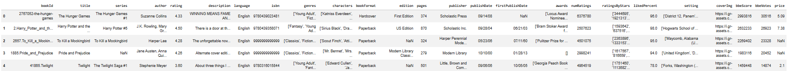
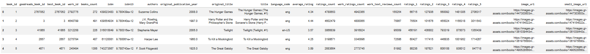
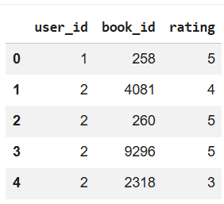
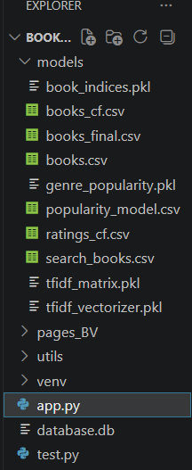
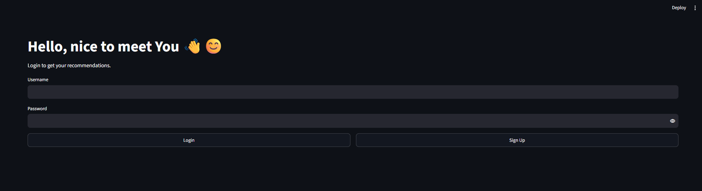
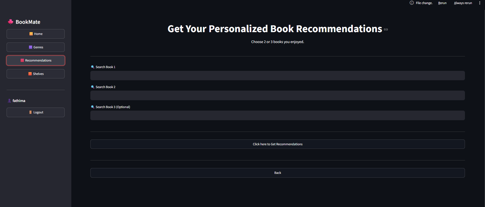
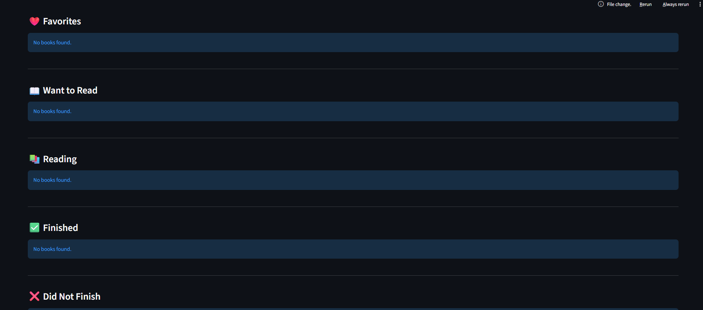
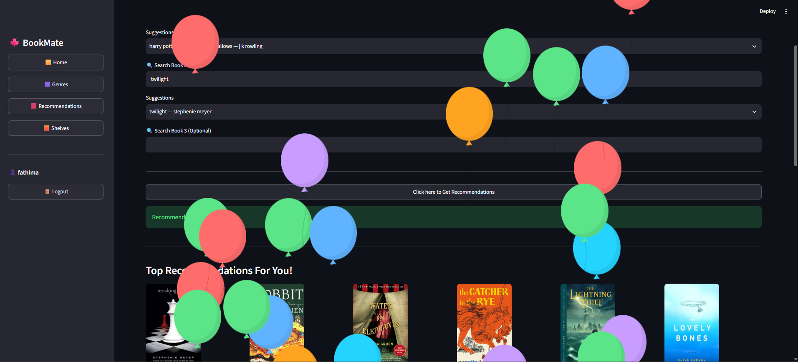

## 🕮 BookMate: AI-Powered Book Recommendation System
BookMate is an AI-powered book recommendation system and it recommends books using hybrid approach that involves Content-Based Filtering, and Collaborative Filtering. The application was develeoped using streamlit and an SQLite database that offers more than just recommendtaion and includes multiple module such as login,Home, Genres catalog, recomendations page and shelves for users.

Feautures:
- Profile Registration and Login
- Personalized Book Recommendations by selecting upto 3 books
- Hybrid Recommendation System
- Search Books option 
- Book Details with Similar Books at bottom
- Genre based Book Browsing
- Reading Shelves with add or remove option
  - Currently Reading
  - Want to Read
  - Finished
  - Did Not Finish
  - Favorites
- Profile Logout

## Built With:
- Python, Streamlit, SQLite,Pandas, NumPy, Scikit-learn, NLTK
- Visual Studio Code and Google Colab

## Download Model Files

The saved model files and datasets are stored in google drive as they exceed GitHub's file size limits.

**Download here:**

**Google Drive:**  
https://drive.google.com/drive/folders/1FQhXiZ4poY26qJYnrzzXkTZJ90kXrELT?usp=sharing

After downloading, copy all the files into the **models** folder

## Dataset

The project uses publicly available dataset called bestbooksever and goodbooks user rating datasets for recommendation system

### Books Dataset snippets





### Ratings Dataset (Sample)



## Project structure



## Installation

### Clone the repository

```bash
git clone <repository_link>
```

### Install the required libraries

```bash
pip install -r requirements.txt
```

### Run the application

```bash
streamlit run app.py
```
## Results

The developed recommendation system successfully generates personalized book recommendations using a hybrid recommendation approach. The application combines content-based similarity with memory based collaborative filtering to improve recommendation relevance and diversity.











## 🖋️ Author
**Fathima Fadeela H**
