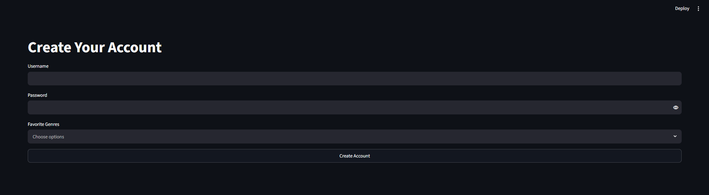
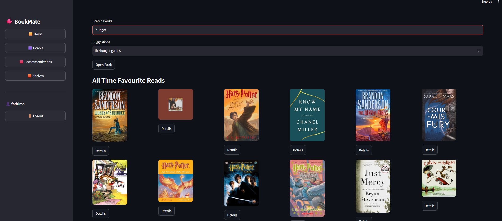
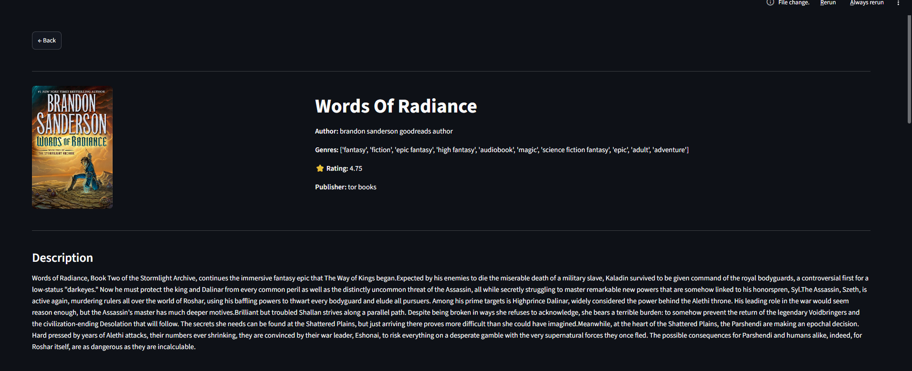

# 1. Introduction

BookMate is an AI-powered book recommendation system that was developed to help users discover books based on their interests. The application combines **Content based Filtering**, **Memory based Collaborative Filtering**, and a **Hybrid Recommendation** approach to generate personalized recommendations. It also provides features such as reading shelves, favorites, genre browsing, and detailed book information through an interactive web interface.


# 2. System Requirements

Hardware

- Computer or Laptop
- Minimum 4 GB RAM

 Software

- Windows 10/11
- Python 3.x
- Streamlit

# 3. Installation

### Step 1

Clone or download the project from GitHub.

### Step 2

Download the required model files from the Google Drive link provided in the README.

### Step 3

Copy all downloaded files into the **models/** folder.

### Step 4

Install the required Python libraries.

```bash
pip install -r requirements.txt
```

### Step 5

Run the application.

```bash
streamlit run app.py
```

---

# 4. Running the Application

After running the above command, the application will open automatically in your default web browser.


# 5. Application Features Details

## Login

- Enter your username and password.
- Click **Login** to access the application.


## Sign Up

- Create a new account with username and password.
- Select your preferred genres.
- Click Sign Up.




## Home Page
The Home page displays:

- Popular books
- selected Genre-based book collections
- search bar 

Click on **details** to open detailed information about a book.




## Recommendations

- Search and select upto 3 books.
- Click **get personalized recommendation**


## Book Details

The Book Details page displays:

- Book Cover
- Title
- Author
- Genres
- Rating
- Description
- Similar Book Recommendations

Users can also add books to their favorites or reading shelves.




## Shelves

Users can organize books into:

- Currently Reading
- Want to Read
- Finished
- Did Not Finish
- Favorites


